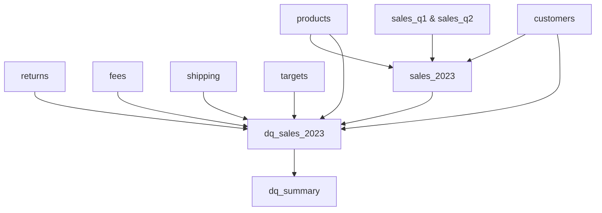

# e-commerce etl + dq  
### power query etl • data quality validation • documentation-driven project

an end-to-end analytics project demonstrating a **complete etl and data validation pipeline in power query (m language)**.  
the workflow covers data ingestion, cleaning, transformation, validation, and documentation - following a real-world e-commerce use case.

## project overview
**etl + validation summary:**  
for a complete overview of the process and outputs, see ➡️ [etl-summary.md](docs/etl-summary.md)

## repository structure
```
ecommerce-etl-dq/
│
├── 📁 etl/
│   ├── etl-pipeline.md
│   ├── etl-walkthrough.md
│   ├── README.md
│   ├── 📁 queries/
│   │   ├── sales_2023.pq
│   │   ├── sales_q1.pq
│   │   ├── sales_q2.pq
│   │   ├── customers.pq
│   │   ├── products.pq
│   │   ├── returns.pq
│   │   ├── fees.pq
│   │   ├── shipping.pq
│   │   ├── targets.pq
│   │   └── README.md
│   └── 📁 functions/
│       ├── fx_clean.pq
│       ├── fx_text.pq
│       ├── fx_number.pq
│       ├── fx_date.pq
│       ├── fx_logical.pq
│       ├── fx_package_size.pq
│       ├── fx_country.pq
│       ├── fx_diacritics.pq
│       └── README.md
│
├── 📁 validation/
│   ├── validation-walkthrough.md
│   ├── validation-rules.md
│   ├── README.md
│   ├── 📁 queries/
│   │   ├── dq_sales_2023.pq
│   │   ├── dq_products.pq
│   │   ├── dq_customers.pq
│   │   ├── dq_returns.pq
│   │   ├── dq_shipping.pq
│   │   ├── dq_fees.pq
│   │   ├── dq_targets.pq
│   │   ├── dq_summary.pq
│   │   └── README.md
│   └── 📁 functions/
│       ├── fx_null_or_blank.pq
│       ├── fx_is_numeric.pq
│       ├── fx_is_between.pq
│       ├── fx_in_set.pq
│       └── README.md
│
├── 📁 data/
│   ├── 📁 sample/
│   │   ├── sales_2023_raw_sample.xlsx
│   │   └── sales_2023_final_sample.xlsx
│   ├── sales_2023_raw.xlsx
│   └── README.md
│
├── 📁 docs/
│   ├── etl-summary.md
│   ├── data-dictionary.md
│   ├── data-model.md
│   ├── data-model-diagram.png
│   └── README.md
│
├── 📁 .github/
│   ├── 📁 ISSUE_TEMPLATE/
│   │   ├── bug_report.md
│   │   ├── feature_request.md
│   │   └── config.yml
│   ├── pull_request_template.md
│   └── contributing.md
│
├── LICENSE
├── .gitignore
└── README.md
```

## documentation index
| file | description |
|------|--------------|
| [`etl-pipeline.md`](./etl/etl-pipeline.md) | etl architecture overview and power query data flow |
| [`etl-walkthrough.md`](./etl/etl-walkthrough.md) | detailed walkthrough of the etl pipeline for sales, products, and customers |
| [`validation-walkthrough.md`](./validation/validation-walkthrough.md) | step-by-step explanation of data quality checks and rule execution |
| [`etl-summary.md`](./docs/etl-summary.md) | overview of the complete etl and validation workflow |
| [`data-model.md`](./docs/data-model.md) | explanation of schema structure and relationships |
| [`data-dictionary.md`](./docs/data-dictionary.md) | full metadata reference for columns and data types |
| [`dq_summary.pq`](./validation/queries/dq_summary.pq) | final data quality aggregation query |

## project goals
- design a **modular etl pipeline** in power query for e-commerce data  
- apply **systematic validation rules** to ensure data integrity  
- create a **fully documented, reproducible project** for portfolio demonstration  
- provide **sample data outputs** before and after validation  
- maintain a **hybrid star schema** optimized for analytics  

## data overview
| category | details |
|-----------|----------|
| **source** | synthetic e-commerce dataset (`sales_2023_raw.xlsx`) with 8 sheets: sales q1, sales q2, products, customers, returns, shipping, fees, targets |
| **sample files** | [`sales_2023_raw_sample.xlsx`](./data/sample/sales_2023_raw_sample.xlsx) and [`sales_2023_final_sample.xlsx`](./data/sample/sales_2023_final_sample.xlsx) |
| **size** | ~1,500 records total |
| **handled issues** | missing foreign keys, invalid dates, duplicates, inconsistent text casing, mixed formats, orphaned returns |
| **final outputs** | `sales_2023` (fact table) → validated via `dq_sales_2023` → aggregated in `dq_summary` |

## etl → validation flow


## key functions
| category | main functions | purpose |
|-----------|----------------|----------|
| **etl** | `fx_clean`, `fx_text`, `fx_number`, `fx_date`, `fx_logical`, `fx_package_sieze`, `fx_country`, `fx_diacritics` | cleaning, normalization, parsing, standardization |
| **validation** | `fx_null_or_blank`, `fx_is_between`, `fx_in_set`, `fx_is_numeric` | validation and dq rule evaluation |

📘 see detailed documentation:  
- [`/etl/functions/README.md`](./etl/functions/README.md)  
- [`/validation/functions/README.md`](./validation/functions/README.md)

## sample outputs
- `/data/sample/sales_2023_raw_sample.xlsx` → before cleaning and validation  
- `/data/sample/sales_2023_final_sample.xlsx` → after full etl and validation process  

## reproduce the project
### prerequisites
before starting, make sure you have:
- **microsoft excel 365** with **power query** enabled  
### quick start
1. **clone the repository**
   ```bash
   git clone https://github.com/moniburnejko/ecommerce-etl-dq.git
   ```
2. **open the sample data**
   - `/data/sample/sales_2023_raw_sample.xlsx`
3. **load functions into power query**
   - from `/etl/functions` and `/validation/functions`
4. **follow the etl process**
   - see [`etl-walkthrough.md`](./etl/etl-walkthrough.md)
5. **run validation**
   - see [`validation-walkthrough.md`](./validation/validation-walkthrough.md)
6. **inspect results**
   - check `/data/sample/sales_2023_final_sample.xlsx` 

## license
this project is released under the **mit license**.  

## connect
👩‍💻 **Monika Burnejko**  
*data analyst in training | excel & power query | data quality & etl*  
📧 [monikaburnejko@gmail.com](mailto:monikaburnejko@gmail.com)  
💼 [linkedin](https://www.linkedin.com/in/monika-burnejko-9301a1357)  
🌐 [portfolio](https://www.notion.so/monikaburnejko/Data-Analytics-Portfolio-2761bac67ca9807298aee038976f0085?pvs=9)

---
<p align="center">
🌟 if you found this project helpful, please consider giving it a star! 🌟
</p>
