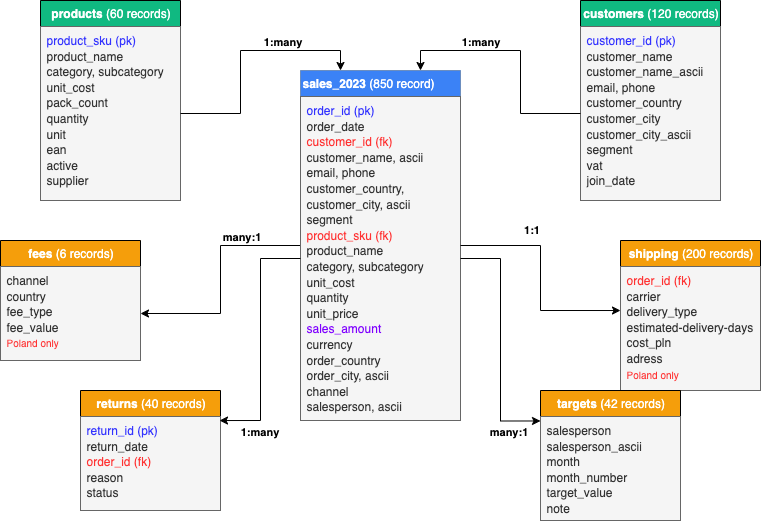

# data model
this data model is based on a **hybrid star schema** with **`sales_2023`** as the central fact table.  
the fact table includes some product and customer information directly, which makes analysis faster and easier.  
other tables such as `returns`, `shipping`, `fees`, and `targets` remain separate because they have different levels of detail or apply to fewer records.

- **type:** hybrid star (with a lightly denormalized fact table)  
- **tables:** 7 (1 fact, 2 dimensions, 4 supporting)  
- **total records:** ~1,500

## relationships diagram

  

## table roles & grain
### fact table
- **`sales_2023`** — one row per **order** for the year 2023  
  - includes transaction details such as `quantity`, `unit_price`, and `sales_amount`  
  - also contains key customer and product details for faster filtering and analysis  

### dimensions
- **`products`** - one row per **product** (`product_sku`)  
- **`customers`** - one row per **customer** (`customer_id`)  

### supporting tables
- **`returns`** - one row per **return** (`return_id`), linked to an `order_id`  
- **`shipping`** - one row per **order_id**, containing delivery information  
- **`fees`** - one row per **channel and country**, defining local fee rules (currently Poland only)  
- **`targets`** - one row per **salesperson and month**, representing sales goals  

> note: supporting tables are stored separately to keep the main fact table compact and to reflect their unique level of detail (for example, `targets` is monthly, while `sales_2023` is daily).

## relationships
| from | to | key(s) | cardinality |
|------|----|--------|-------------|
| `products` | `sales_2023` | `product_sku` | 1:many |
| `customers` | `sales_2023` | `customer_id` | 1:many |
| `sales_2023` | `returns` | `order_id` | 1:many |
| `sales_2023` | `fees` | `channel` + `order_country` | many:1 |
| `sales_2023` | `shipping` | `order_id` | 1:1 |
| `sales_2023` | `targets` | `salesperson` | many:1 |

## primary & foreign keys
### products (dimension)
- **primary key:** `product_sku`  
- **used by:** `sales_2023.product_sku`  

### customers (dimension)
- **primary key:** `customer_id`  
- **used by:** `sales_2023.customer_id`  

### sales_2023 (fact)
- **business key:** `order_id` (unique per order)  
- **foreign keys:**  
  - `customer_id` → `customers.customer_id`
  - `product_sku` → `products.product_sku`   
  - `order_id` → `shipping.order_id` (optional, 1:1)  
  - `order_id` → `returns.order_id` (optional, 1:many)  
  - (`channel`, `order_country`) → `fees.(channel, country)`  
  - (`salesperson`) → `targets.(salesperson)`  

### returns (supporting)
- **primary key:** `return_id`  
- **foreign key:** `order_id` → `sales_2023.order_id`  

### shipping (supporting)
- **primary/foreign key:** `order_id` → `sales_2023.order_id` (1:1 expected)  

### fees (supporting)
- **primary key:** (`channel`, `country`)  
- **joined using:** `channel`, `order_country` (renamed as `country`)  

### targets (supporting)
- **primary key:** (`salesperson`)  
- **joined using:** `salesperson`  

## denormalization - why and when
some product and customer fields are stored directly in `sales_2023` to make the data easier and faster to work with.

**advantages:**
- **faster queries:** no need to join dimension tables for most reports  
- **simpler use:** analysts can work with one table for most analyses  
- **better performance:** fewer joins mean faster aggregations  

**trade-offs:**
- **slightly larger file size** (but small enough to be manageable)  
- **updates required** if master data changes  
- **handled by etl:** the etl process keeps data synchronized with dimension tables  

## business rules & scope
- **returns:** kept separate because only about 5% of orders have returns  
- **fees & shipping:** apply only to Poland; keeping them separate makes future expansion easier  
- **targets:** monthly granularity, separated to support planning and goal analysis  
- **date range:** data limited to the 2023 calendar year  
- **units:** product packages standardized into `pack_count`, `quantity`, and `unit` (e.g. L, kg)

## key column groups
- **ids:** `order_id`, `customer_id`, `product_sku`  
- **dates:** `order_date`  
- **measures:** `quantity`, `unit_price`, `sales_amount`, `unit_cost` (for margin)  
- **customer details:** `customer_name`, `customer_country`, `customer_city`, `segment`  
- **product details:** `product_name`, `category`, `subcategory`  
- **sales details:** `channel`, `salesperson`  
- **geo info:** `order_country`, `order_city`  

## data quality alignment
- **foreign keys:** validated through dq rules (`product_sku`, `customer_id`, `order_id`)  
- **date validation:** all `order_date` values within 2023  
- **numeric checks:** `quantity ≥ 1`, `unit_price ≥ 0`  
- **lookup validation:** `fees` and `targets` tables verified against their expected combinations  

📅 *last updated: october 2025*  
👩‍💻 *author: Monika Burnejko*
