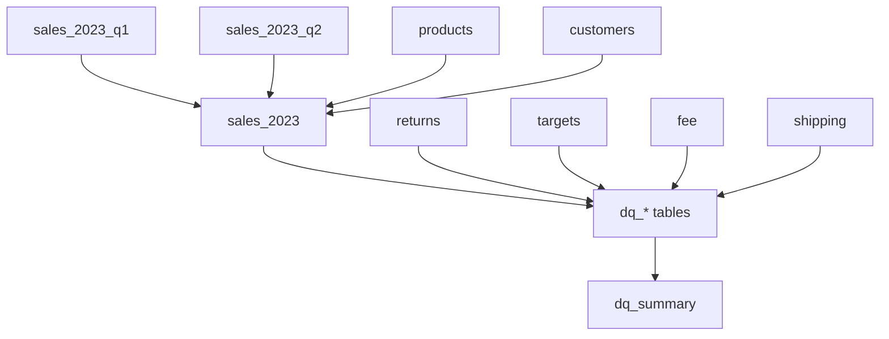

# etl pipeline
this document provides a high-level overview of the power query etl (extract-transform-load) process for the **ecommerce etl + dq** project.  
it describes the architecture, logical flow, and key components used to transform fragmented e-commerce operational data into a unified analytics-ready dataset.

## overview
the etl pipeline integrates multiple raw data sources - sales, customers, products, returns, shipping, fees, and sales targets - from a single excel file:  
[`/data/sample/sales_2023_raw.xlsx`](../data/sample/sales_2023_raw.xlsx).  

through a series of standardized transformations, these sources are cleaned, normalized, and merged into one consolidated dataset:  
**`sales_2023`**, later validated in the [`/validation`](../validation).

## etl architecture

## etl logic components
| component | location | description |
|------------|-----------|-------------|
| **etl functions** | [`/etl/functions`](./functions) | reusable m-language scripts for cleaning, parsing, and normalization (e.g., `fx_clean`, `fx_text`, `fx_number`, `fx_date`, `fx_package_size`, `fx_logical`). |
| **etl queries** | [`/etl/queries`](./queries) | main transformation logic: imports, standardizes, joins, and enriches data from multiple source sheets into unified tables. |
| **raw data** | [`/data/sample/sales_2023_raw.xlsx`](../data/sample/sales_2023_raw.xlsx) | input file containing multiple worksheets: `sales_2023_q1`, `sales_2023_q2`, `products`, `customers`, `returns`, `targets_wide`, `fees`, and `shipping`. |
| **output dataset** | [`sales_2023`](./queries/sales_2023.pq) | final dataset joining sales transactions with product and customer dimensions, enriched with pricing, segmentation, and geographic data. |

## etl flow
1. **source loading**  
   - imports all worksheets from `sales_2023_database_raw.xlsx`  
   - uses `fx_clean` to trim whitespace and standardize column naming (`snake_case`)

2. **cleaning & normalization**  
   - standardizes text, numeric, and date fields using helper functions:  
     - `fx_text` - normalizes casing, removes control characters, trims spaces  
     - `fx_number` - parses mixed numeric formats, unifies decimal separators  
     - `fx_date` - converts multiple date formats and excel serials  
     - `fx_logical` - standardizes boolean flags (`yes/no`, `true/false`, `1/0`)  
     - `fx_package_size` - parses and normalizes packaging details (e.g. `12x330ml → pack_count=12, quantity=0.33, unit=L`)

3. **schema standardization**  
   - aligns all tables to a unified schema  
   - renames columns for consistency (e.g., `OrderDate` → `order_date`)  
   - harmonizes country names using `fx_country`  

4. **merging & enrichment**  
   - combines quarterly sales (q1 + q2)  
   - adds derived column `sales_amount = quantity * unit_price`  
   - joins with `products` (adds `product_name`, `category`, `subcategory`, `unit_cost`)  
   - joins with `customers` (adds `customer_name`, `email`, `phone`, `customer_country`, `customer_city`, `segment`, and `ascii helper columns`)  

5. **dimension integration**  
   - ensures referential integrity for `customer_id` and `product_sku`  
   - connects supplementary datasets: `returns`, `fees`, `targets`, and `shipping`  
   - creates consistent keys and foreign-key lookups for dq validation  

6. **validation handoff**  
   - outputs `sales_2023` as the unified fact table
   - downstream dq checks (`/validation/queries/dq_*.pq`) to ensure integrity and consistency    
   - validation results summarized in `dq_summary` 

## output datasets
| dataset | description |
|----------|-------------|
| **sales_2023** | consolidated, standardized fact table combining q1 and q2 transactions with product and customer data. |
| **dq_*** | record-level dq tables, checking data quality rules (e.g., missing order_id, invalid currency, fk mismatches). |
| **dq_summary** | aggregated summary of data validation results, including record counts and severity-based issue breakdowns. |

sample outputs are available in:  
[`/data/sample/sales_2023_sample.xlsx`](../data/sample/sales_2023_sample.xlsx)

## related documentation
- [**etl-walkthrough**](./etl-walkthrough.md) - step-by-step explanation of each transformation stage  
- [**validation-walkthrough**](../validation/validation-walkthrough.md) - describes post-etl validation and dq checks  
- [**etl-functions**](./functions) - reusable helper scripts  
- [**etl-queries**](./queries) - all core transformation queries  

## notes
- etl logic is modular and scalable - supports additional sales quarters or marketplace integrations.  

📅 *last updated: october 2025*  
👩‍💻 *author: Monika Burnejko*
